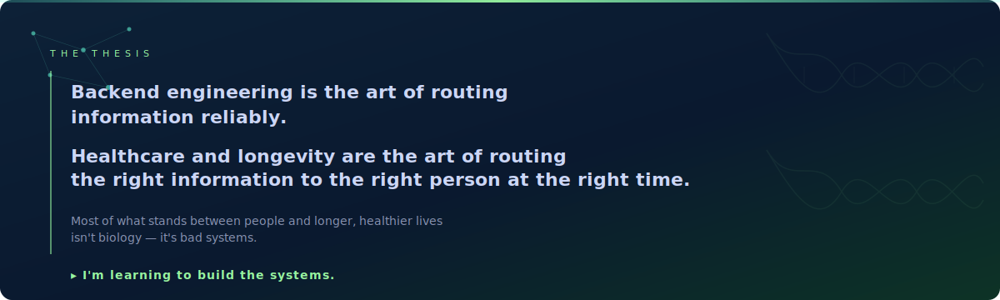
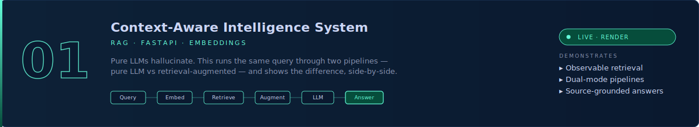
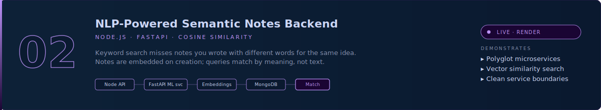
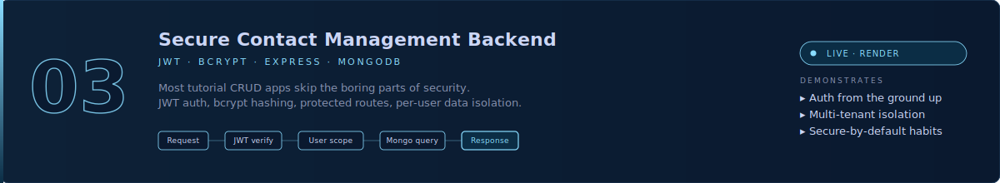
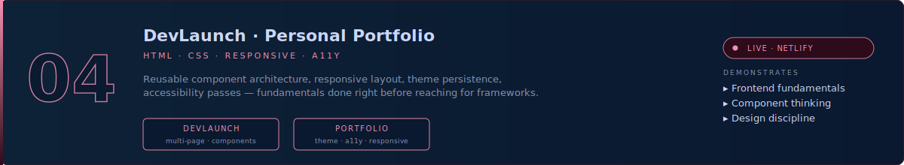

<!-- ═══════════════════════════════════════════════════════════════ -->
<!--    HERO — Custom SVG (Bioluminescent Neural)                     -->
<!-- ═══════════════════════════════════════════════════════════════ -->

<a href="https://github.com/JAGAT-JYOTI-BISWAL">
  
</a>

<br/>

<!-- Quick links -->
<div align="center">


&nbsp;
[](https://linkedin.com/in/jagatjyotibiswal)
&nbsp;
[](https://jagatjyotibiswall-portfolio.netlify.app)
&nbsp;
[](mailto:jagatjyotibiswal2@gmail.com)

</div>


<!-- ═══════════════════════════════════════════════════════════════ -->
<!--    POSITIONING                                                   -->
<!-- ═══════════════════════════════════════════════════════════════ -->

## 🌊 &nbsp;Who I Am

```
I'm a backend-first engineer learning to put intelligence
inside production systems — not as a demo, but as
infrastructure.

I work with Node.js, FastAPI, and Python to build APIs
that retrieve, reason, and respond: RAG pipelines,
semantic search, embedding-driven services, secured with
auth and shipped as microservices.

I want my work to eventually serve a specific cause:
human healthspan and longevity.
```


<!-- ═══════════════════════════════════════════════════════════════ -->
<!--    THE THESIS — Custom SVG card                                  -->
<!-- ═══════════════════════════════════════════════════════════════ -->



<sub>**Where I want to point this →** personalized health intelligence · longevity dashboards · disease-prevention agents · behavior-change infrastructure · AI tools that respect biology and pay attention to the user.</sub>


<!-- ═══════════════════════════════════════════════════════════════ -->
<!--    CURRENTLY BUILDING                                            -->
<!-- ═══════════════════════════════════════════════════════════════ -->

## 🛠️ &nbsp;Currently Building &nbsp;<sub><i>· updated May 2026</i></sub>

```
▸  Iterating on my Context-Aware Intelligence System —
   adding hybrid retrieval (BM25 + dense) and a re-ranker
   so the RAG comparison demo gets sharper.

▸  Studying production-grade vector DBs (pgvector, Qdrant)
   and how to scale embedding pipelines past toy datasets.

▸  Sketching a longevity micro-tool: a small backend that
   ingests biomarker data and returns evidence-graded,
   source-cited recommendations — RAG over peer-reviewed papers.

▸  Reading: "Outlive" (Attia), "The Pragmatic Programmer",
   and the Llama / Qwen technical reports.
```


<!-- ═══════════════════════════════════════════════════════════════ -->
<!--    TECH STACK                                                    -->
<!-- ═══════════════════════════════════════════════════════════════ -->

## ⚙️ &nbsp;Tech Stack

<div align="center">

<sub>


</sub>
<br/>
[](https://skillicons.dev)

<br/><br/>

<sub>


</sub>
<br/>
[](https://skillicons.dev)

<br/><br/>

<sub>


</sub>
<br/>
[](https://skillicons.dev)

<br/><br/>

<sub>


</sub>
<br/>


</div>


<!-- ═══════════════════════════════════════════════════════════════ -->
<!--    FEATURED PROJECTS — Custom SVG cards                          -->
<!-- ═══════════════════════════════════════════════════════════════ -->

## 🔭 &nbsp;Featured Projects

<br/>

<a href="https://github.com/JAGAT-JYOTI-BISWAL/context-aware-intelligence-system">
  
</a>

<div align="center">

[](https://github.com/JAGAT-JYOTI-BISWAL/context-aware-intelligence-system)
&nbsp;
[](https://context-aware-intelligence-system.onrender.com)

</div>

<sub>⚠️ Free tier — may take 30–60s to wake on first load.</sub>

<br/><br/>

<a href="https://github.com/JAGAT-JYOTI-BISWAL/semantic-notes-nlp-backend">
  
</a>

<div align="center">

[](https://github.com/JAGAT-JYOTI-BISWAL/semantic-notes-nlp-backend)
&nbsp;
[](https://semanticc-notesapi-f6wy.onrender.com)

</div>

<sub>⚠️ Free tier — may take 30–60s to wake on first load.</sub>

<br/><br/>

<a href="https://github.com/JAGAT-JYOTI-BISWAL/secure-contact-backend">
  
</a>

<div align="center">

[](https://github.com/JAGAT-JYOTI-BISWAL/secure-contact-backend)
&nbsp;
[](https://secure-contacttbackend.onrender.com/)

</div>

<sub>⚠️ Free tier — may take 30–60s to wake on first load.</sub>

<br/><br/>



<div align="center">

[](https://github.com/JAGAT-JYOTI-BISWAL/devlaunch)
&nbsp;
[](https://lipundevlaunchh.netlify.app)
&nbsp;
[](https://github.com/JAGAT-JYOTI-BISWAL/jagat-portfolio-website)
&nbsp;
[](https://jagatjyotibiswall-portfolio.netlify.app)

</div>


<!-- ═══════════════════════════════════════════════════════════════ -->
<!--    OPEN TO COLLABORATE                                           -->
<!-- ═══════════════════════════════════════════════════════════════ -->

## 🤝 &nbsp;Open To

```
✓  Backend / AI internships  —  India or remote
✓  Building production RAG systems & semantic-search infra
✓  Health, longevity, or biotech-adjacent AI projects
✓  Open-source contributions in the ML / backend ecosystem
✓  Conversations with people building at the AI × biology edge
```

<sub>Reach me at <a href="mailto:jagatjyotibiswal2@gmail.com">jagatjyotibiswal2@gmail.com</a> or via <a href="https://linkedin.com/in/jagatjyotibiswal">LinkedIn</a>. I read every message.</sub>


<!-- ═══════════════════════════════════════════════════════════════ -->
<!--    GITHUB STATS                                                  -->
<!-- ═══════════════════════════════════════════════════════════════ -->

## 📊 &nbsp;GitHub Stats

<div align="center">


&nbsp;&nbsp;


</div>

<br/>

<div align="center">


</div>

<br/>

<div align="center">


</div>

<br/>

<div align="center">


</div>


<!-- ═══════════════════════════════════════════════════════════════ -->
<!--    SNAKE                                                         -->
<!-- ═══════════════════════════════════════════════════════════════ -->

## 🐍 &nbsp;Contribution Graph

<div align="center">

<picture>
  <source media="(prefers-color-scheme: dark)" srcset="https://raw.githubusercontent.com/JAGAT-JYOTI-BISWAL/JAGAT-JYOTI-BISWAL/output/github-snake-dark.svg"/>
  <source media="(prefers-color-scheme: light)" srcset="https://raw.githubusercontent.com/JAGAT-JYOTI-BISWAL/JAGAT-JYOTI-BISWAL/output/github-snake.svg"/>
  
</picture>

</div>


<!-- ═══════════════════════════════════════════════════════════════ -->
<!--    CONNECT                                                       -->
<!-- ═══════════════════════════════════════════════════════════════ -->

## 🌐 &nbsp;Connect

<div align="center">

| &nbsp; | Platform | Link |
|---|---|---|
| 🌊 | Portfolio | [jagatjyotibiswall-portfolio.netlify.app](https://jagatjyotibiswall-portfolio.netlify.app) |
| 💼 | LinkedIn | [linkedin.com/in/jagatjyotibiswal](https://linkedin.com/in/jagatjyotibiswal) |
| 📬 | Email | [jagatjyotibiswal2@gmail.com](mailto:jagatjyotibiswal2@gmail.com) |

</div>


<div align="center">

<sub><i>Build systems. Build clarity. Build quietly.</i></sub>

</div>
